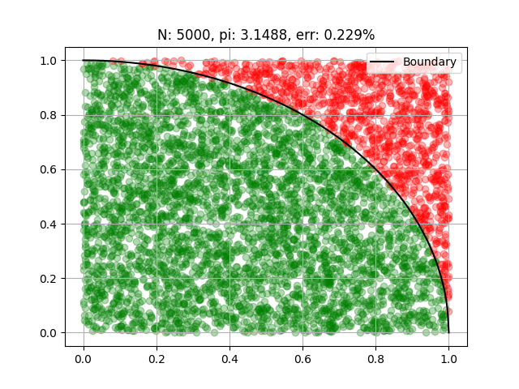

# Probabilistic Programming

## Introduction

円周率 $\pi$ は Feynman が最も美しい数式[^Feynman]としてあげたオイラーの等式

$$
e^{i\pi} + 1 = 0
$$

にも現れるように、数学上最も重要な概念の一つであるが、無理数であるため数値で表すには無限大の精度が必要である。
そのため計算機上では $\pi$ は厳密な数値としては扱えず、近似的に表す以外ない。
そこでいくつかの方法で円周率を計算してみよう。

一つの方法は次の恒等式

$$
\frac{\pi}{4} = \int^1_0 \frac{dx}{1 + x^2},
\tag{1}
\label{MonteCarloIntegral::PiQuater}
$$

で右辺の積分を数値的に実行し、その結果を４倍することで求める。
台形近似で積分を実行

```python
def trapezoid_pi():
    integrand = lambda x: 1.0 / (1.0 + x ** 2.0)
    delta = 1 / N
    x = 0
    area = 0
    for n in range(1, N):
        upper = x + n*delta
        lower = x + (n-1) * delta
        area += 0.5 * delta * (integrand(lower) + integrand(upper))

    return 4.0 * area
```

<p align="center">
  <b>List 1.</b>
  台形近似で円周率を求めるプログラム。
</p>

した結果は $\pi = 3.1411926069191316$ となり、 `numpy`に実装されている円周率との誤差が0.01%である。

| N | pi | error |
| -: | -: | -: |
| 5 | 2.691023675 | 14.342%
| 50 | 3.101121988 | 1.288%
| 500 | 3.137587983 | 0.127%
| 5000 | 3.141192607 | 0.013%
| 50000 | 3.141552653 | 0.001%
| - | 3.141592653 | 0.000%

<p align="center">
  <b>Table 1.</b>
  台形近似を用いた円周率とその誤差。
  最後の行はオンライン整数列大辞典の数列 <a href="https://oeis.org/A000796">A000796</a>の値。
</p>

$$
\frac{\pi}{4} = \int_{D} dx dy,
\quad D: 0 \leq x, y \leq 1,\ x^2 + y^2 \leq 1
$$

この積分を乱数を（無理矢理）使って計算してみよう。
以下のように書き換える:

$$
\begin{aligned}
\frac{\pi}{4}
&= \iint^1_0 \theta(1 - x^2 - y^2) dx dy
= \iint^1_0 \frac{p(x,y)\theta(1 - x^2 - y^2)}{p(x,y)} dx dy
\\\\ & \sim \frac{1}{N}\sum_{n=1}^N \frac{\theta(1 - x_n^2 - y_n^2)}{p(x,y)}
= \frac{1}{N}\sum_{n=1}^N \theta(1 - x_n^2 - y_n^2)
\end{aligned}
$$

ここで $p(x,y)$ は確率密度関数であり区間 $[0,1]$ の一様分布を表す。
$N$ は $p(x,y)$ によってサンプリングされた点の数で、 $x_n, y_n$ はその各点の座標値を表す。
また $\theta(x)$ はステップ関数である。

この方法では積分を実行するのに一様分布からサンプリングされた点を用いている。
このように何らかの確率から生成された乱数を用いて計算を行うことを**モンテカルロ法**、特に積分に用いたものを**モンテカルロ積分**という。
積分を実行するプログラムをList 2.に示す。
またその結果をTable 2.に示す。

```python
def calc_pi():

    for i in tqdm(range(N)):
        x, y = np.random.rand(2)
        if x ** 2 + y ** 2 <= 1.0:
            accepted[0].append(x)
            accepted[1].append(y)
            # plt.plot(x, y, marker="o", c="g", alpha=0.3, mec="g")
        else:
            rejected[0].append(x)
            rejected[1].append(y)
            # plt.plot(x, y, marker="o", c="r", alpha=0.3, mec="r")

    pi = 4.0 * len(accepted[0]) / N
    return pi
```

<p align="center">
<b>List 2.</b>
モンテカルロ法で円周率を求めるプログラム
</p>

| N | pi | error |
| -: | -: | -: |
| 5 | 4.0 | 27.324%
| 50 | 3.04 | 3.234%
| 500 | 3.112 | 0.942%
| 5000 | 3.1488 | 0.229%
| 50000 | 3.14376 | 0.069%
| - | 3.14159265 | 0.000%

<p align="center">
  <b>Table 2.</b>
  モンテカルロ法を用いた円周率とその誤差
</p>

<p align="center">
  
</p>

<p align="center">
  <b>Figure 1.</b>
  Monte Carlo pi
</p>

ここでやっていることを理解するために、上で計算したものを任意の関数 $f(x)$ に一般化して考えてみる。 
積分の中で確率密度関数 $p(x)$ を使って

$$
I = \int f(x) dx = \int \frac{f(x)}{p(x)} p(x) dx
$$

と書き換えると、これは $f(x)/p(x)$ の期待値を表している。この期待値はすなわち母平均のことであるから、
標本平均の期待値に一致する。また大数の法則より標本数を十分用意すれば標本平均は母平均に収束する。
すなわちモンテカルロ積分は、大数の法則を利用して、積分を**確率 $p(x)$ に従う確率変数 $x$ を用いて 
$f(x)/p(x)$ の標本平均に置き換える数値積分法**である。

## Importance sampling

円周率の例では一様分布を用いて積分を求めたが、いつでも一様分布がいいとは限らない。
例えばある領域だけが積分値に大きな寄与を与えるような関数をモンテカルロ積分するときには、
その周辺から外れた点をたくさん計算しても積分結果にはほとんど影響を与えない。
より効率良くモンテカルロ積分を実行するためには積分値に寄与が大きい領域をたくさんサンプリングすることが必要である。

以上のステートメントを実際に確かめてみよう。最初にやったように、再び円周率 $\pi$ を求める積分を考えよう。

$$
\pi = \int^\infty_{-\infty} \frac{dx}{1 + x^2},
$$

この積分は(1)とほとんど同じであるが、ここでは積分範囲を変更して $-\infty$ から $\infty$ としており、
直接 $\pi = 3.1415926535...$ の値を求めることができる。

この積分を一様分布を用いて計算する。ただし計算機では無限大を直接扱うことはできないので適当に大きな範囲の
一様分布から $x$ を抽出する。区間 $[-10^6, 10^6]$ からサンプル数 $N = 5000$ としたときの積分値として
$0.6854534702131444$ が得られる。

| $N$ | Dist | Value | Error |
| :-: | :-: | :-: | :-: |
| 10 | Uniform | # | # |
| 100 | Uniform | # | # |
| 1000 | Uniform | # | # |
| 5000 | Uniform | 0.6854534702131444 |
| 10 | Normal | # |
| 100 | Normal | # |
| 1000 | Normal | # |
| 5000 | Normal | 2.7389483413282285 |

## Markov Chain Monte Carlo method

マルコフ連鎖モンテカルロ法（MCMC）[^2018Fukushima]

状態の母集団から $N$ 個の標本をサンプリングすると、そのサンプル集合に対してある分布
$\vec{\pi}^{(i)} = (\pi^{(i)}_1, \pi^{(i)}_2, \cdots, \pi^{(i)}_N)^T$ を考えることができる。
この $\pi^{(i)}_s$ は整数 $s$　で指定される状態 $X_s$ が $i$ 番目のサンプリングにおいてどれだけ抽出されるかを表す割合であり、

$$
\sum_{s=1}^{N} \pi^{(i)}_s = 1,
\quad
\pi^{(i)}_s \leq 0,
$$

を満たすベクトルであるから、 $\pi^{(i)}$ を確率ベクトルという。 $i$ はマルコフ連鎖における離散的な時間を表す整数である。
マルコフ連鎖は確率過程の一種でその重要な仮定は、**次の時刻 $i+1$ におけるサンプル集団の分布が
現在の時刻 $i$ の分布だけに依存する**というものである。ベイズの定理より $i+1$ の分布は

$$
P(X^{(i+1)}) = P(X^{(i+1)} | X^{(i)}) P(X^{(i)})
$$

または成分で表すと

$$
\pi_s^{(i+1)} = \sum_t \mathcal{P}_{st} \pi^{(i)}_t
$$

### Peron-Frobenius theorem

次のリファレンス[^2018Takagi]に基づき、マルコフ連鎖の収束に用いるPeron-Frobeniusの定理を紹介する。
ただしここでは定理の証明までは追わないことにする。

**定義 1**: 成分が全て非負の正方行列

$$
A = (A_{ij}),
\quad
A_{ij} \geq 0
\quad
\text{for $1 \leq i, j \leq N$}
$$

を非負行列という。

**定義 2**:
非負行列 $A$ に対し、 $A^m$ の各成分が非零となる自然数 $m$ が存在する時、 $A$ は既約行列であるという。
これは有効グラフの任意の2点間 $i, j$ の間に $i$ から $j$ に向かう矢印の列が存在することと等しい。
（このようなグラフのことを強連結という。）
また既約でない行列のことを可約行列という。

Peron-Frobeniusの定理は、既約な非負行列 $A$ について、
$A$ の固有値のうち一つは実数であり、その固有ベクトルは全ての成分が正の実数であるということを
主張するものである。この固有値、固有ベクトルをそれぞれPeron-Frobenius固有値、Peron-Frobenius固有ベクトルといい、
$\lambda_\text{PF}, ~ \boldsymbol{v}_\text{PF}$と書く。
$\lambda_\text{PF}$ は縮退しておらず、また他の任意の固有値 $\lambda \in \mathbb{C}$ について
$|\lambda| < \lambda_\text{PF}$ を満たす。
これは複素平面上で全ての固有値が半径 $\lambda_\text{PF}$ の内側にあることを示す。

### Detailed balance condition

熱平衡にある２つの状態 $|i\rangle, |j\rangle$ が互いにある確率で遷移するとする。
状態 $|i\rangle$ から状態 $|j\rangle$ への遷移確率を

$$
p(|i\rangle \to |j\rangle) \equiv p(j|i) \equiv p_{i,j},
$$


### Metropolis-Hasting algorithm

詳細釣り合いを満たす遷移確率を決める方法の一種

### Heat bath algolithm

### Hamiltonian Monte Carlo

## Self-Learning Monte Carlo[^2019Nagai]

[^Feynman]: 要出典

[^2018Fukushima]: 福島孝治, < 講義ノート> モンテカルロ法の基礎と応用--計算物理学からデータ駆動科学へ--, 物性研究・電子版, 2018, 7.2: 1-10.,
https://doi.org/10.14989/235551

[^2019Nagai]: 永井 佑紀, 自己学習モンテカルロ法：機械学習を用いたマルコフ連鎖モンテカルロ法の加速, アンサンブル, 2019, 21 巻, 1 号, p. 15-21, 公開日 2020/01/31, Online ISSN 1884-5088, Print ISSN 1884-6750, https://doi.org/10.11436/mssj.21.15, https://www.jstage.jst.go.jp/article/mssj/21/1/21_15/_article/-char/ja

[^2018Takagi]: 高木　俊輔, 行列の冪乗とその応用, 東京大学公開講座, https://www.ms.u-tokyo.ac.jp/web/video/open/2018koukai-kouza/op2018-033.pdf

